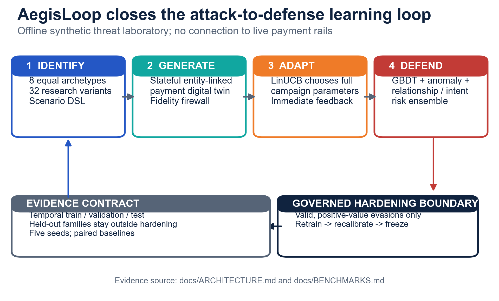
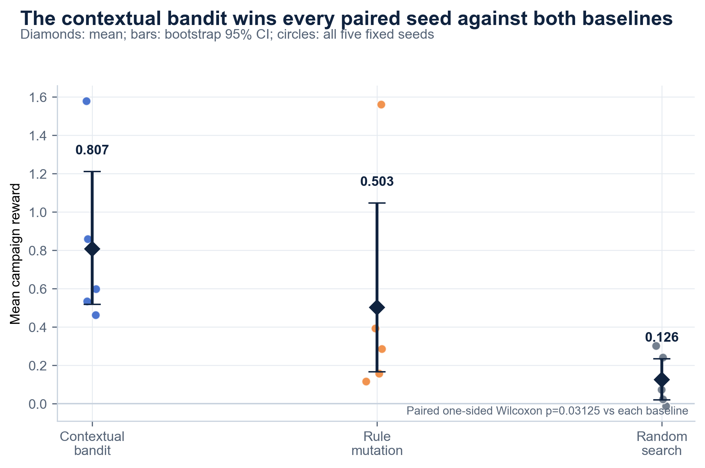
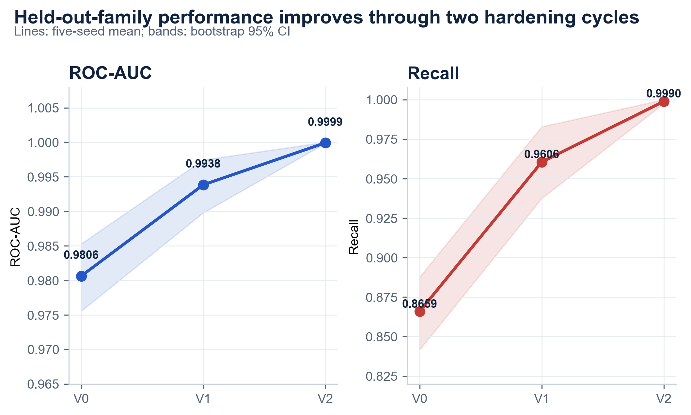
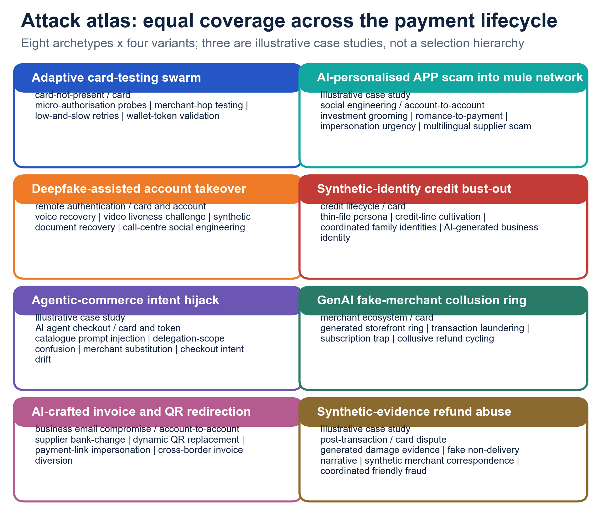
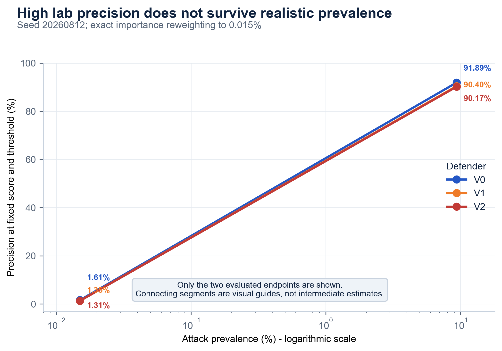

<p align="center">
  
</p>

<h1 align="center">AegisLoop</h1>

<p align="center">
  <strong>A self-evolving payment-threat digital twin.</strong><br />
  Find the attack. Simulate the campaign. Let it adapt. Harden the defense.
</p>

<p align="center">
  <a href="https://aegisloop-mcic-2026.vercel.app"></a>
  <a href="./AegisLoop_Solution_Walkthrough.pdf"></a>
  <a href="./artifacts/full_multiseed/aggregate.json"></a>
</p>

<p align="center">
  
  
  
  <a href="./LICENSE"></a>
</p>

<p align="center">
  <a href="https://aegisloop-mcic-2026.vercel.app"><strong>Open the command center</strong></a>
  &nbsp;&nbsp;·&nbsp;&nbsp;
  <a href="./AegisLoop_Solution_Walkthrough.pdf"><strong>Read the solution walkthrough</strong></a>
  &nbsp;&nbsp;·&nbsp;&nbsp;
  <a href="./RESULTS.md"><strong>Audit the full results</strong></a>
</p>

---

## The decision in one sentence

**AegisLoop turns payment-fraud defense from a one-time model build into a governed learning loop:** a campaign-level contextual bandit searches for valid evasions inside a stateful synthetic payment system, and the successful campaigns become hardening data for the next calibrated defender generation.

This is not a GPT search wrapper. GenAI helps structure safe threat hypotheses at design time; runtime adaptation is a reproducible **LinUCB contextual bandit** operating over typed campaign parameters and black-box defender feedback.

## Why this exists

Static fraud tests answer: *does today's detector catch attacks we already know?* AegisLoop asks the harder question: *what will an adaptive attacker try after observing today's defense—and does the next defender become measurably harder to evade?*

The system is built around four linked requirements:

| Requirement | AegisLoop response |
|---|---|
| **Identify** emerging attacks | An equal-priority atlas of **8 archetypes × 4 variants** captures channel, rail, objective, GenAI enabler, event sequence, and mitigations. |
| **Generate** faithful campaigns | A hand-coded, stateful, entity-linked payment simulator evolves customers, devices, merchants, beneficiaries, timing, velocity, and relationship reuse across ordered events. |
| **Adapt** the red team | LinUCB selects complete campaign strategies from recent defender outcomes; invalid campaigns cannot earn reward. |
| **Defend** and learn | A supervised + unsupervised + relationship-risk ensemble is calibrated on a disjoint legitimate validation split, frozen, attacked, retrained, and tested again. |

## The closed loop

<p align="center">
  <a href="./artifacts/paper/figures/fig01_closed_loop_architecture.png">
    
  </a>
</p>

1. **Compile a threat atlas.** Eight safe archetypes become a typed scenario DSL—never a free-form attack endpoint.
2. **Roll out an entity-linked campaign.** A deterministic agent simulation produces 5–20 temporally ordered events with persistent participants and evolving graph signals.
3. **Enforce the fidelity firewall.** Schema, range, chronology, behavior, and entity-reuse checks reject invalid campaigns before reward is calculated.
4. **Let the attacker adapt.** LinUCB selects the next campaign from context built only from recent black-box defender outcomes.
5. **Harden at a strict generation boundary.** Only valid evasions with positive approved value enter hardening data; V0 → V1 → V2 are independently recalibrated and frozen before evaluation.

> **Defensible novelty claim:** AegisLoop is a campaign-level extension of single-transaction RL fraud-evasion attacks that closes the loop into adversarial defender hardening.

## Evidence at a glance

Every headline below is loaded from a versioned artifact. No single seed is promoted as the result, and null/boundary findings receive the same visibility as positive findings.

| Question | Evidence-locked answer | What it means—and does not mean |
|---|---:|---|
| Does adaptation outperform fixed search? | **0.807 ± 0.457** mean bandit reward vs **0.126 ± 0.139** random and **0.503 ± 0.602** rule mutation; wins **5/5 paired seeds** against each, one-sided paired Wilcoxon **p = 0.03125**. | LinUCB found higher-reward valid campaigns under the fixed full-budget protocol. Five seeds remain a small sample. |
| Does adversarial hardening improve held-out-family detection? | ROC-AUC **0.9806 → 0.9938 → 0.99993** and recall **86.59% → 96.06% → 99.90%** for V0 → V1 → V2. | Strong synthetic held-out-family performance; not a production-fraud estimate. |
| What happened at V2? | Against a **matched, fixed action pool held constant across generations**, V2 detected every campaign across five seeds. | This is deliberately not an unqualified claim that V2 “stops fresh attackers” or production fraud. |
| Did the novelty bonus drive the result? | No measurable improvement: novelty-on minus novelty-off **−0.017** mean reward; two-sided paired Wilcoxon **p = 0.625**. | A useful null result. Novelty remains configurable for traceability, not part of the performance claim. |
| Is V1 → V2 stability conclusive? | Directional only: lower fresh-attacker reward on 4 seeds with 1 tie; one-sided **p = 0.0625**. | One additional generation pair is evidence, not proof of long-run stability. |
| Will laboratory precision survive real base rates? | V2 precision falls from **90.17%** at 9.39% experiment prevalence to **1.31%** after exact reweighting to 0.015%. | This is **seed 20260812-specific**; deployment requires calibrated review capacity and base-rate-aware evaluation. |

<p>
  Sources: <a href="./artifacts/full_multiseed/aggregate.json"><code>aggregate.json</code></a>,
  <a href="./artifacts/full_multiseed/seed_results.csv"><code>seed_results.csv</code></a>,
  <a href="./artifacts/precomputed/v2_campaign_diagnostics.csv"><code>v2_campaign_diagnostics.csv</code></a>, and
  <a href="./artifacts/precomputed/prevalence_metrics.csv"><code>prevalence_metrics.csv</code></a>.
</p>

### Adaptive search and defender hardening

<table>
  <tr>
    <td width="50%" valign="top">
      <a href="./artifacts/paper/figures/fig03_reward_comparison.png"></a>
    </td>
    <td width="50%" valign="top">
      <a href="./artifacts/paper/figures/fig04_defender_progression.png"></a>
    </td>
  </tr>
  <tr>
    <td valign="top"><strong>Adapt:</strong> all five seeds are visible; error bars are bootstrap 95% CIs of the seed-level mean.</td>
    <td valign="top"><strong>Defend:</strong> every generation is evaluated on final families excluded from training, calibration, red-team search, and hardening.</td>
  </tr>
</table>

### Attack breadth without an implied ranking

<p align="center">
  <a href="./artifacts/paper/figures/fig02_attack_atlas.png">
    
  </a>
</p>

The atlas treats all eight archetypes as equal-priority research hypotheses. Three may be used as illustrative case studies in the walkthrough, but no unsupported “top threat” hierarchy is imposed. Explore every family interactively in the [Identify workspace](https://aegisloop-mcic-2026.vercel.app/identify).

### Reality check: high AUC is not high deployment precision

<p align="center">
  <a href="./artifacts/paper/figures/fig06_precision_prevalence.png">
    
  </a>
</p>

The two endpoints are artifact-backed; the connecting line is explicitly a **visual interpolation only**. This base-rate collapse is not buried as a limitation—it is a first-class product panel because it changes how fraud operations teams should interpret laboratory metrics.

## Explore the live command center

The nine-section interface mirrors the solution paper so a judge can move between narrative, product, and evidence without relearning the system.

| Workspace | Judge-facing question |
|---|---|
| [**Mission Briefing**](https://aegisloop-mcic-2026.vercel.app) | What decision does this product enable in 60 seconds? |
| [**Identify**](https://aegisloop-mcic-2026.vercel.app/identify) | Which attack families and mitigations are represented? |
| [**Generate**](https://aegisloop-mcic-2026.vercel.app/generate) | Is the simulation stateful, chronological, and entity-linked? |
| [**Adapt**](https://aegisloop-mcic-2026.vercel.app/adapt) | What does the bandit learn, and what does each reward term mean? |
| [**Defend**](https://aegisloop-mcic-2026.vercel.app/defend) | Does V0 → V1 → V2 hardening improve held-out-family efficacy? |
| [**Reality Check**](https://aegisloop-mcic-2026.vercel.app/reality-check) | What survives realistic prevalence—and what collapses? |
| [**Evidence & Governance**](https://aegisloop-mcic-2026.vercel.app/evidence) | Can every displayed claim be traced and the calibration split audited? |
| [**Live Benchmark**](https://aegisloop-mcic-2026.vercel.app/benchmark) | Can a judge run a bounded illustrative experiment without conflating it with archived evidence? |
| [**Methodology**](https://aegisloop-mcic-2026.vercel.app/methodology) | How would this map into a governed payment-risk workflow? |

## Technical design

```text
Threat research       Stateful digital twin     Adaptive red team        Defender hardening
8 archetypes      ->  linked campaign events -> LinUCB campaign policy -> V0 -> V1 -> V2
32 variants           fidelity firewall          logged reward terms      recalibrate + freeze
```

| Layer | Implementation |
|---|---|
| Threat representation | Safe typed attack DSL with 8 archetypes and 32 variants |
| Simulation | Deterministic, hand-coded, PaySim-style agent simulation with persistent entities and evolving temporal/graph features |
| Adaptive policy | Shared LinUCB contextual bandit; immediate campaign reward makes this a contextual-bandit problem rather than a long-horizon MDP |
| Reward | Fidelity-weighted approved value, evasion, detection cost, resource cost, and optional first-novel-success term; every component is logged |
| Defender | Gradient-boosted supervised score + isolation score + explicit relationship/intent risk |
| Evaluation | Temporal legitimate split, campaign-disjoint fraud split, disjoint calibration validation, final held-out families, five fixed seeds |
| Product | Next.js 16 App Router, TypeScript, Tailwind CSS, D3/Recharts, Zod-validated artifact APIs, accessible loading/error/empty states |
| Research runtime | Python 3.11+, NumPy, pandas, scikit-learn, SciPy |

Read the exact design in [Architecture](./docs/ARCHITECTURE.md) and the reconciled protocols in [Benchmarks](./docs/BENCHMARKS.md).

## Run it locally

### Web command center

Requirements: Node.js 20+ and pnpm 10.

```bash
pnpm install --frozen-lockfile
pnpm dev
```

Open `http://localhost:3000`. On Windows, `run_demo.ps1` performs the same launch; on Linux/macOS, use `./run_demo.sh`.

### Reproduce the evidence

```bash
python -m venv .venv
python -m pip install -r requirements-dev.txt
python -m pytest -q
python experiments/run_multiseed.py --output artifacts/reproduction_full
python scripts/make_figures.py
```

The full protocol is intentionally separate from the bounded **illustrative quick run** exposed in the web UI. Quick-run output is never substituted for the archived five-seed evidence.

### Verify the complete product

```bash
pnpm lint
pnpm test
pnpm build
pnpm test:e2e
python -m pytest -q
```

The browser suite checks the complete command center against WCAG 2 A/AA rules at laptop viewport. Python tests cover attack-schema safety, simulator determinism and fidelity, leakage-resistant calibration, reward reconciliation, benchmark resilience, and artifact loading behavior.

## Evidence provenance

The web UI fails closed when an approved artifact is absent or malformed. Charts in this README and the paper are generated directly from the same versioned files by [`scripts/make_figures.py`](./scripts/make_figures.py).

<details>
<summary><strong>Open the seven-artifact evidence ledger</strong></summary>

| Artifact | Purpose |
|---|---|
| [`aggregate.json`](./artifacts/full_multiseed/aggregate.json) | Five-seed means, SDs, bootstrap CIs, ablations, and paired significance tests |
| [`seed_results.csv`](./artifacts/full_multiseed/seed_results.csv) | Per-seed strategy and defender-generation results |
| [`calibration_audit.json`](./artifacts/precomputed/calibration_audit.json) | Disjoint train, validation-calibration, and held-out test proof |
| [`prevalence_metrics.csv`](./artifacts/precomputed/prevalence_metrics.csv) | Seed-20260812 prevalence stress test and exact reweighting |
| [`v2_campaign_diagnostics.csv`](./artifacts/precomputed/v2_campaign_diagnostics.csv) | Matched-pool V2 validity, detection, fidelity, action, and reward-term diagnostics |
| [`attack_atlas.json`](./artifacts/precomputed/attack_atlas.json) | Eight-archetype, 32-variant attack taxonomy |
| [`representative_campaign.json`](./artifacts/precomputed/representative_campaign.json) | Deterministically generated stateful, chronological, entity-linked campaign rollout |

</details>

## Repository map

```text
├── src/app/                    # Nine-section Next.js product + evidence APIs
├── src/components/             # Atlas, campaign timeline, charts, command-center UI
├── src/lib/evidence/           # Manifest, schemas, fail-closed artifact loader
├── src/aegisloop/              # Attack DSL, simulator, fidelity, bandit, defender
├── experiments/                # Quick and full reproducible evaluation runners
├── artifacts/full_multiseed/   # Immutable submission-grade five-seed evidence
├── artifacts/precomputed/      # Audits, diagnostics, atlas, representative rollout
├── scripts/                    # Reproducible figure, campaign, and paper builders
├── docs/                       # Architecture, benchmarks, responsible AI
├── tests/                      # Python model/simulator/resilience tests
└── tests-web/                  # Data-contract, contrast, and browser-accessibility tests
```

The original Streamlit [`app.py`](./app.py) remains as a legacy reference prototype. The Next.js command center is the final web artifact.

## Responsible-use boundary

AegisLoop is an **offline defensive simulator**. It uses no real cardholder data, has no payment-rail connectors, rejects PII-like fields, and exposes only versioned synthetic evidence. Attack descriptions are abstract scenario parameters—not operational instructions. A production deployment would still require governed feature pipelines, outcome labels, drift monitoring, model-risk approval, and champion/challenger rollout; none is claimed to exist in this prototype.

## Submission artifacts

- [Live web prototype](https://aegisloop-mcic-2026.vercel.app)
- [Solution walkthrough paper](./AegisLoop_Solution_Walkthrough.pdf)
- [Full results and limitations](./RESULTS.md)
- [Phase 1 evidence changelog](./PHASE1_CHANGELOG.md)
- [Architecture and technical validity](./docs/ARCHITECTURE.md)
- [Benchmark protocol](./docs/BENCHMARKS.md)
- [Responsible AI record](./docs/RESPONSIBLE_AI.md)

---

<p align="center">
  Built for the <strong>Mastercard Innovation Challenge 2026</strong>.<br />
  Released under the <a href="./LICENSE">Apache License 2.0</a>.
</p>
